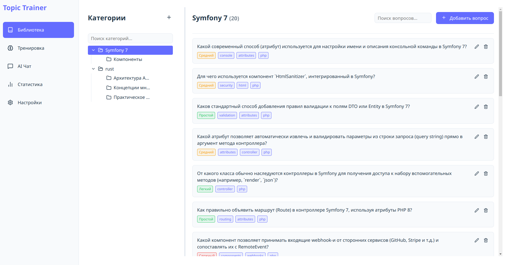

# topic-trainer-ai

Навайбкоженное SPA(github-pages) приложение для обучения и тренировки знаний с использованием искусственного интеллекта(openrouter).

Демо: https://hightemp.github.io/topic-trainer-ai/

## Особенности

- **AI-Powered Question Generation**: Автоматическое создание вопросов по заданным темам с использованием AI.
- **Interactive Learning**: Интерактивные тренировки с обратной связью от AI.
- **Progress Tracking**: Отслеживание прогресса и слабых мест.
- **Customizable**: Настройка категорий, тегов и сложности вопросов.
- **Markdown Support**: Поддержка Markdown для вопросов и ответов.

## Screenshots

